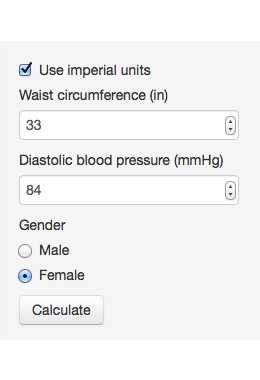
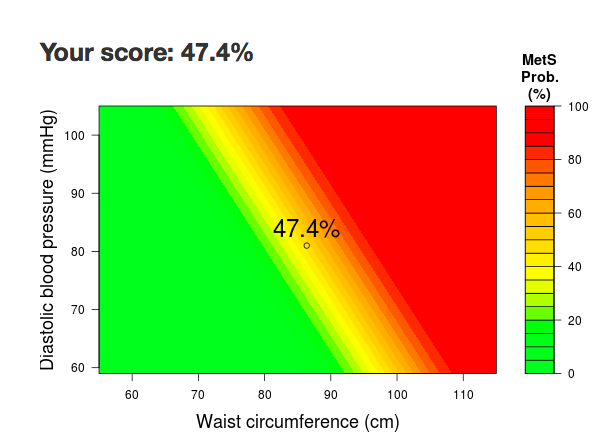

## What is metabolic syndrome?

Metabolic syndrome is a collection of metabolic risk factors.  It is diagnosed when a person has
three of the following five conditions:

- Abdominal obesity
- High blood pressure
- High triglyceride level
- Low HDL cholesterol level
- High fasting blood sugar level

If you have metabolic syndrome, you're in much higher risk for cardiovascular disease and diabetes.  It is estimated that around a third of the US population is afflicted, and that proportion increases with age.

---

## What is the metabolic syndrome risk calculator?



To get a proper diagnosis of metabolic syndrome, you'd need to go to a hospital and do a blood test.  However, we can calculate a "risk score" for metabolic syndrome, using two measurements that are much easier to obtain.

1. Waist circumference: Place the tape measure around your natural waist line, just above the hip bone.  Record the value in either centimeters or inches.

2. Diastolic blood pressure: This is the lower of the two values when you measure your blood pressure.  You can find a blood pressure monitor in many places, but since they're quite inexpensive, you might consider having one at home -- it may be a good investment.

--- .class #id 

## How to interpret the result?




After clicking the "Calculate" button, you'll see your risk score displayed as a percentage.  This number roughly corresponds to the odds of having the metabolic syndrome.

You'll also see the waist and blood pressure values plotted on a gradient.  If the point lands in the yellow or red area, that indicates a high risk of metabolic syndrome, and you should really start taking better care of your health!

---

## Reference

The MetS risk score is calculated as follows:

$$ Logit(MetS\ Odds) = -27.07 + 0.193 \times WC\ (cm) + 0.109 \times DBP\ (mmHg) + 1.47 \times
\text{female}$$

For example, for a female with 75 cm waist circumference, 80 mmHg diastolic blood pressure:

```r
logit_odds <- -27.07 + 0.193 * 75 + 0.109 * 80 + 1.47
1 / (1 + exp(-logit_odds))    # Sigmoid function
```

```
## [1] 0.08279
```

**The above formula** is adapted from a trained logistic regression model, originating from the research paper listed below.  Please keep in mind that this paper studied a very specific demographic group, which may or may not generalize well to the general population.

Lin CC, Bai YM, Chen JY, Hwang TJ, Chen TT, Chiu HW, Li YC. Easy and Low-Cost Identification of Metabolic Syndrome in Patients Treated with Second-Generation Antipsychotics: Artificial Neural Network and Logistic Regression Models. J Clin Psychiatry 2010; 71(3):225-234.


